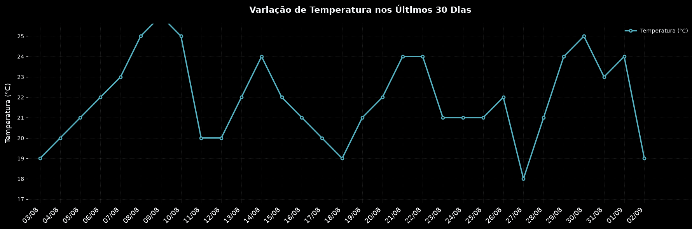

# OpenMeteoView
O OpenMeteoView é uma aplicação moderna desenvolvida para consumir os dados meteorológicos globais da API pública Open-Meteo e transformá-los em painéis visuais altamente informativos.

## Primeiro script

O arquivo `temperatura_30_dias.py` é o primeiro script desenvolvido para o projeto. Ele consulta as temperaturas horárias dos últimos 30 dias na API Open-Meteo, calcula a média diária e gera um gráfico com a variação da temperatura ao longo do período.

### Resultado

## Segundo Script 

No arquivo `temperaturas_regiao_brasil.py`, foram implementadas melhorias para a coleta automatizada das temperaturas das capitais do Brasil, incluindo a exportação dos dados para o formato JSON. O código foi totalmente estruturado utilizando Programação Orientada a Objetos (POO), garantindo maior organização, modularidade e ganho de performance. Para manter a arquitetura limpa, as classes foram centralizadas em um módulo separado chamado utils.py.